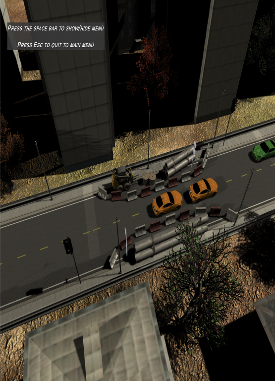
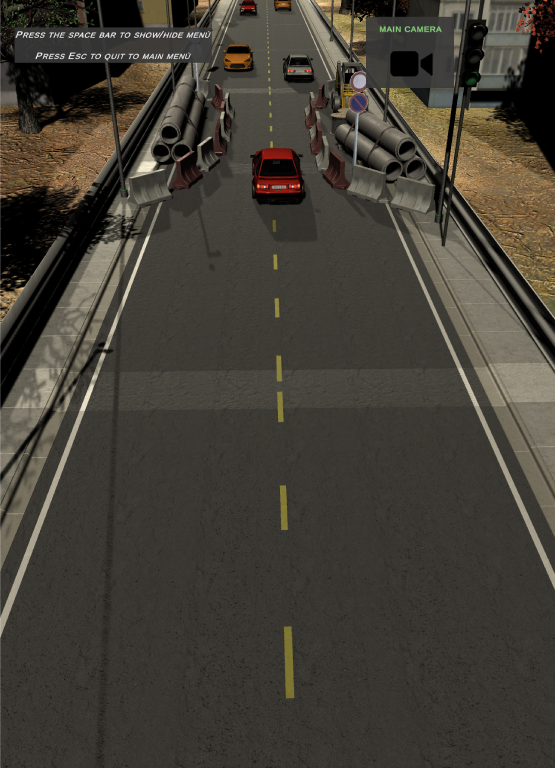
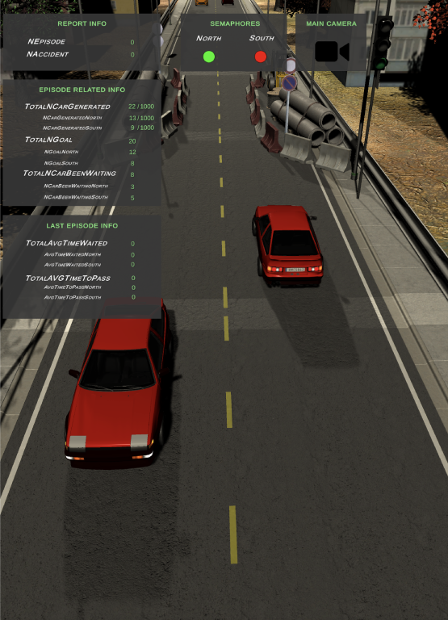
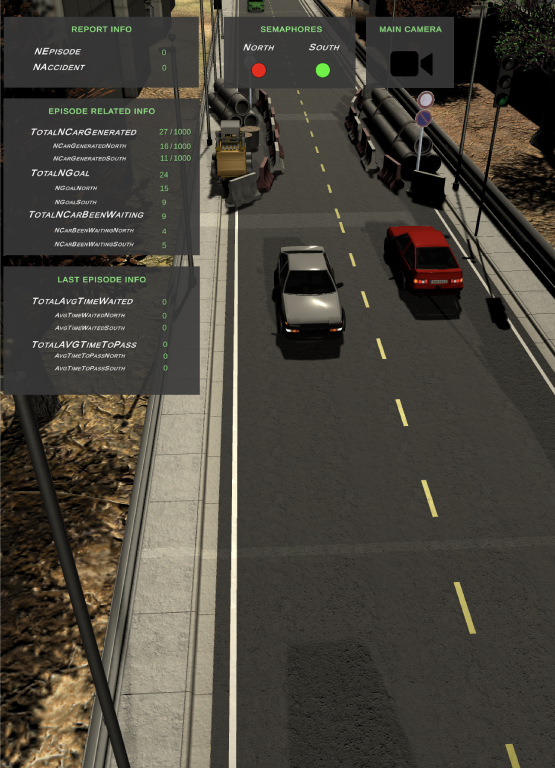

# Cognitive semaphores

### Thesis project:
One of the worst problem of today, is driving. Driving has become really frustrating and
one of the problems are level round crossings on the streets. Those are tedious and they often
make you to waste time due to bad programming.
So, a solution could be to make traffic lights smart and make them manage where green goes and 
where red goes.

## Prerequisites:
Python installed to make script that analyse data to work.

## Authors:
<table>
  <tbody>
    <tr>
      </td>
        <td align="center" valign="top">
        
         
        <a href="https://github.com/andrea-claro">Andrea Claro</a>
      </td>
      </td>
        <td align="center" valign="top">
        
         
        <a href="https://github.com/DvdCp">Davide Capuano</a>
      </td>      
      </tr>
  </tbody>
</table>

## Helpful links:
ML Agents: https://github.com/Unity-Technologies/ml-agents 

### Screenshots
|               Screen_1                |                Screen_2		|
|     :---:                         |          :---:                    	|
|      |     |
|               Screen_3                |                Screen_4		|
|      |     |

## Demo

|               Menu                |                Demo             |
|     :---:                         |          :---:                    |
|      |     |
